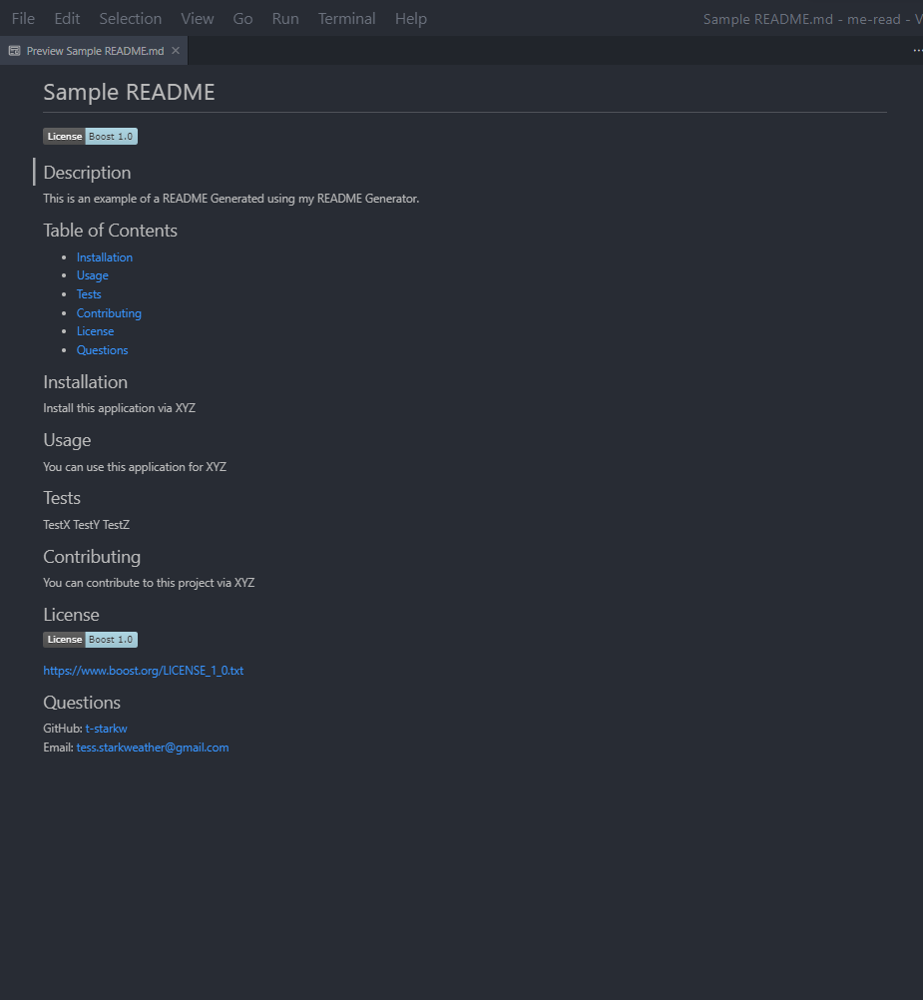

# Node.js - Inquirer README Generator
  

  ## Description
  This application utilizes the inquirer NPM package to capture user input through the command line interface and generate a personalized README file.

  

  ## Table of Contents
  * [Installation](#installation)
  * [Usage](#usage)
  * [Tests](#tests)
  * [Contributing](#contributing)
  * [License](#license)
  * [Questions](#questions)

  ## Installation
  tbd

  ## Usage
  To generate your own README for your next project or application, simply call the following command in your preferred terminal:
  
  `node index.js`

and answer the prompts that follow.

  ## Tests
  N/A

  ## Contributing
  N/A

  ## License
  
  
  https://opensource.org/licenses/MIT 
    

  ## Questions
  GitHub: [t-starkw](https://github.com/t-starkw)  
  Email: tstark@gmail.com